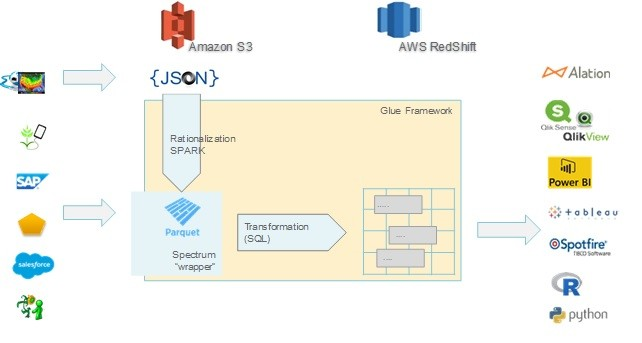

# Enterprise_DataModelling

This scenario shows how data can be ingested into a cloud environment from an on-premises data warehouse of an Agricultural Industry, then served using a business intelligence (BI) model. This approach could be an end goal or a first step toward full modernization with cloud-based components.

This EDM, a set of marts, is the go-to point for integrated data, data sourced from multiple SAP systems, from various proprietary R&D systems, from salesforce.com and from other internal and external sources. All those data sources are combined and integrated into a coherent modelling framework, accelerating data provisioning for reporting, analytical and other digital use cases, including advanced analytics /data science.

This article focuses on the ETL technology and the journey of getting there, the other articles address design and the transition.

Technically the ETL process builds on S3 objects, mapping them with the glue catalog and spectrum to “SQL-tables” in Redshift, thereafter using Glue processes with embedded SQL to transform the data into conformed dimension tables in Redshift.

## Getting the data into S3 was relatively easy

Getting the data into S3 was relatively easy, either by S3 becoming one more subscriber of our standardized messages on the integrated middle-ware or by means within the SAP environment or by API-calls / Json files. The most challenging aspect was probably getting salesforce.com data at scale – and reliably and actually getting at the data’s true source, getting to the horse’s mouth. Any step in between is a potential source of error – and trust me - the user of the data will find every single missing entry or attribute.

The data from those sources are largely incompatible or they need specialist knowledge to combine. This not so much for technology reasons but for their content. All these sources have their own way of looking at and of coding data. Each system speaks its own language. We had to specifically convert, format and adapt the data to achieve an integrated enterprise data model.

### Experimented with several technologies

We experimented with several technologies for performing those transformations. PDI was abandoned for reasons of available knowledge and complexity of operating it. Thereafter we tried native AWS glue and its built-in transformations. Yet we were largely unsuccessful. The functionality is too limited and not robust on real-life data sets. The processes were slow, knowledge scarce and the development process cumbersome. The resulting solutions were unstable and difficult to maintain. Especially rationalizing complex JSONs using Glue was not stable enough to cope with real-life data quality.

### Spark, catalog and plain SQL

Finally, we settled on Spark for rationalizing JSONs, Glue catalog and Spectrum for the S3 mapping and on plain old-fashioned SQL embedded in the Glue framework for the transformations and updates. The resulting scripts are automated using Lambda and the basics of the glue framework. That - simple - approach has the advantage of readily available knowledge, fast, agile development cycles, good collaboration and superior performance and transparency. Ultimately, we templated the approach, resulting in low cost and fast time to benefits.

  

<b>Scenario 1:</b> System Flow.

We can’t beat physical or re-invent big data. Yet this approach provides availability of integrated data very early in the process. This enables a close interaction with the business user, early validation of the business case on integrated data thus focusing the development effort and accelerating time to value. 

# Workflow

## Data source
The source data is located in an SQL Server database in Azure. To simulate the on-premises environment, deployment scripts for this scenario provision an Azure SQL database. The AdventureWorks sample database is used as the source data schema and sample data. For information on how to copy data from an on-premises database, see copy and transform data to and from SQL Server.

## Ingestion and data storage
1. Azure Data Lake Gen2 is used as a temporary staging area during data ingestion. You can then use PolyBase to copy data into an Azure Synapse dedicated SQL pool.

2. Azure Synapse Analytics is a distributed system designed to perform analytics on large data. It supports massive parallel processing (MPP), which makes it suitable for running high-performance analytics. Azure Synapse dedicated SQL pool is a target for ongoing ingestion from on-premises. It can be used for further processing, as well as serving the data for Power BI through DirectQuery.
