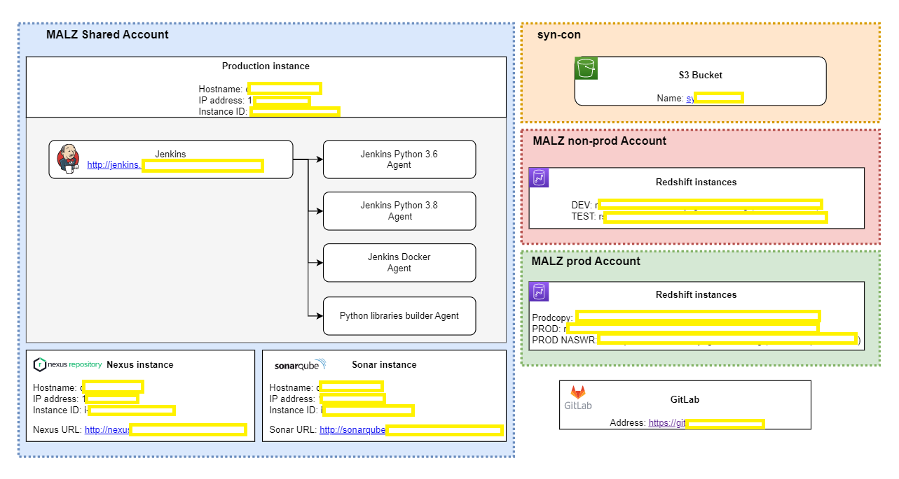
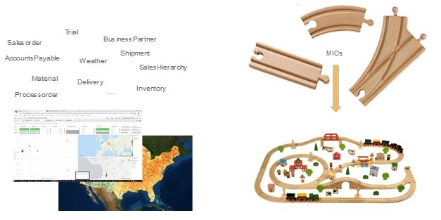
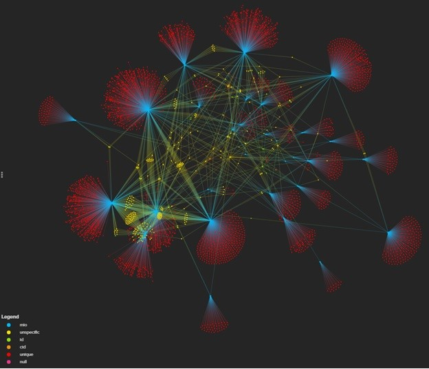
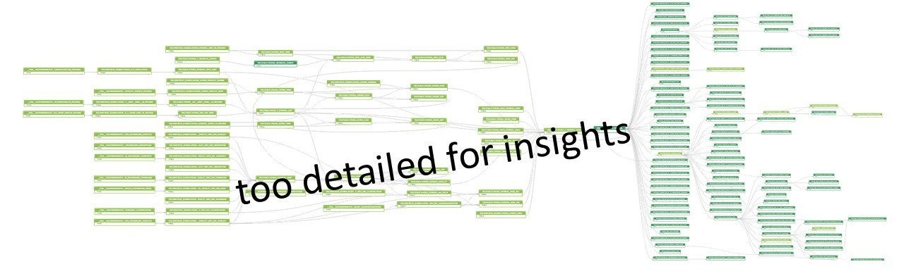
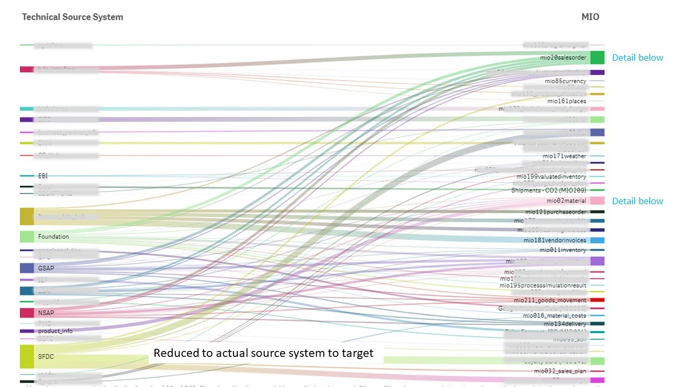
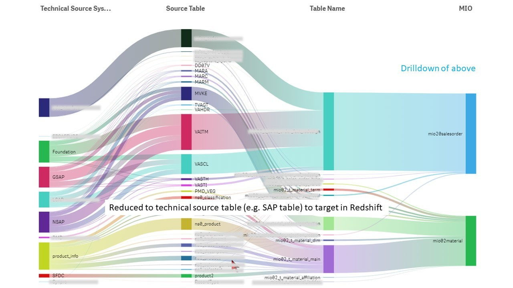

# Architecting Success: A Global Enterprise Data Model Journey

This scenario shows how data can be ingested into a cloud environment from an on-premises data warehouse of an Agricultural Industry, then served using a business intelligence (BI) model. This approach could be an end goal or a first step toward full modernization with cloud-based components.

This EDM, a set of marts, is the go-to point for integrated data, data sourced from multiple SAP systems, from various proprietary R&D systems, from salesforce.com and from other internal and external sources. All those data sources are combined and integrated into a coherent modelling framework, accelerating data provisioning for reporting, analytical and other digital use cases, including advanced analytics /data science.

This article focuses on the ETL technology and the journey of getting there, the other articles address design and the transition.

Technically the ETL process builds on S3 objects, mapping them with the glue catalog and spectrum to “SQL-tables” in Redshift, thereafter using Glue processes with embedded SQL to transform the data into conformed dimension tables in Redshift.

# Infrastructure Overview

As an independent open source project, the Jenkins project maintains most of its own infrastructure including services which help to keep the project running. The kind of things that fall into "infrastructure" can span from operating virtual machines, containers, configuring network or developing and maintaining project-specific applications to make the development of Jenkins core and plugins more efficient.

Because we strongly believe in Open Source principles, we also apply them to our infrastructure. As such we consider ourself as an open infrastructure project where everybody is invited to learn, share, contribute.

  

<b>Figure 1:</b> Jenkins Infra - Overview.

## Contributing

Thier infrastructure is an open infrastructure project made by and for the Jenkins community. In other words, it’s a contributors driven project.

  

<b>Figure 2:</b> Contribution Workflow - Jenkins.

## Deployment

The deployment step is the only moment where we need approval from someone with elevated permission. As already mentioned, even if we try to be as open as possible, we don’t want to share privileged accesses with every contributors even if we trust them and that mainly for security reasons.

  

<b>Figure 3:</b> Our Jenkins Infra.

## Getting the data into S3 was relatively easy

Getting the data into S3 was relatively easy, either by S3 becoming one more subscriber of our standardized messages on the integrated middle-ware or by means within the SAP environment or by API-calls / Json files. The most challenging aspect was probably getting salesforce.com data at scale – and reliably and actually getting at the data’s true source, getting to the horse’s mouth. Any step in between is a potential source of error – and trust me - the user of the data will find every single missing entry or attribute.

The data from those sources are largely incompatible or they need specialist knowledge to combine. This not so much for technology reasons but for their content. All these sources have their own way of looking at and of coding data. Each system speaks its own language. We had to specifically convert, format and adapt the data to achieve an integrated enterprise data model.

### Experimented with several technologies

We experimented with several technologies for performing those transformations. PDI was abandoned for reasons of available knowledge and complexity of operating it. Thereafter we tried native AWS glue and its built-in transformations. Yet we were largely unsuccessful. The functionality is too limited and not robust on real-life data sets. The processes were slow, knowledge scarce and the development process cumbersome. The resulting solutions were unstable and difficult to maintain. Especially rationalizing complex JSONs using Glue was not stable enough to cope with real-life data quality.

### Spark, catalog and plain SQL

Finally, we settled on Spark for rationalizing JSONs, Glue catalog and Spectrum for the S3 mapping and on plain old-fashioned SQL embedded in the Glue framework for the transformations and updates. The resulting scripts are automated using Lambda and the basics of the glue framework. That - simple - approach has the advantage of readily available knowledge, fast, agile development cycles, good collaboration and superior performance and transparency. Ultimately, we templated the approach, resulting in low cost and fast time to benefits.

  

<b>Scenario 1:</b> System Flow.

We can’t beat physical or re-invent big data. Yet this approach provides availability of integrated data very early in the process. This enables a close interaction with the business user, early validation of the business case on integrated data thus focusing the development effort and accelerating time to value.

## AWS Redshift serving data sciences and data visualization

We implemented an Enterprise Data Model (EDM) in AWS Redshift serving data sciences and data visualization. This data mart is the go-to point for integrated data, sourced from multiple SAP systems, from various proprietary R&D systems, from salesforce.com and from other internal and external sources. All those data sources are combined and integrated into a coherent modelling framework, accelerating data provisioning for the entire organization (14 Billion USD revenue, 200 countries) across reporting, analytical and other digital use cases, including advanced analytics /data science.

### Myriad of use cases from one Enterprise Data Model

The design is based on a few assumptions

- there is a myriad of use cases of data from an EDM, all based on varying combinations, filters and aggregations of a much smaller set of basic “mini-marts”.
- real-world systems are heterogeneous, have a multitude of operational (source) systems. Data only becomes usable if we bridge those gaps, eliminate complexity and simplify accessibility.
- data quality challenges exist in real environments. The data marts must be neither dependent on nor assume perfect data quality but rather make discrepancies transparent without judgement.

This led to the design - and implementation - of an enterprise data model in a novel way that has proven to be stable, sustainable, scalable, pragmatic and fast. It avoids complexity and costs of a classical data vault. Most importantly the EDM’s complexity remains flat even as its scope grows beyond textbook examples to a real-world size and scope.

### A collection of mini-marts

The enterprise data model is in essence a collection of mini-marts, each of them a [atomic] component for a star model on steroids. We call these components MIOs, Managed Information Objects, or mini-marts. Those mini-marts get combined into use-case specific data marts (queries, views). I use the analogy of a (BRIO) toy railway. A limited set of individual railway track pieces, basically straights, curves and switches, allows building tremendous variations of railway tracks. The mini-marts are like those individual railway track pieces. They all fit together by a simple set of rules, regardless of their technical origin. That allows flexibly, addressing a myriad of different use cases from the same basic set of objects.

  

<b>Scenario 2:</b> Mini Marts - In General.

This flexibility is enabled by a set of rules:

1. Knowledge about the world : a MIO is neither a report nor simply a source table. It is knowledge, facts about how we do business as a company in its finest granularity and in standardized form, free of business interpretation, designed for easy consumption.
2. Purpose : A MIO has a clear content. This sounds simple yet has proven to be surprisingly tricky in a company with a long history. (A good stem is “One row in that object tell me that….”) It usually takes three iterations to distill the true essence out of convoluted descriptions with systems, mystical process complexity and local terminology. Yet having clarity on what it really means is essential.
3. Finest grain : data is captured at finest grain. The “knowledge” itself is pure data, is has no interpretation or implicit business assumptions. 
4. Source system agnostic: A MIO is source system agnostic. Using an example : R&D systems, marketing services and production and supply each have their own view and knowledge of looking at a "material". It becomes surprisingly simple to have all these sources contribute to one and the same data object for material and collectively enriching it. The same is also possible for different sales data (internal and external), inventory, marketing activity data etc. Those generalization are essential.
5. Conformed rules: the rules how MIOs integrate, the joins, are standardized and irrespective of source system.
6. Generic: While the priority of the mini-marts implementation is driven by business use cases, the mini-marts are use-case agnostic and can be used beyond the initial use-case.
7. Independent: each mini-mart can be implemented and tested independently of any other, curbing complexity and enabling fast implementation and quick time to delivery.

### The mini-marts eliminate complexity

Complexity often results from variations of data in different systems. If there are two variations at the first level, the next level has to deal with four, the subsequent with eight and complexity puts a limit of what we can do. The minimarts eliminate that complexity by all objects adhering to either of two standard design patterns and by having no implicit assumptions. They are based on natural business keys (not traditional UUIDs), thus eliminating technical cross dependencies between objects and simplifying ETL processes. The independence of objects in turn allows to cope with different "interpretations " of data quality as they exist in real world organizations. Each (dimensional) object is implemented assuming that there are multiple (synonym) identifiers. This to account for ambiguities and making them transparent. Today's tools and environments are powerful enough to cope with it and aggregate and join data dynamically, at least with the moderate data volume we have of a few 100 millions records each.

I like the phrase : it is difficult to understand Paris if you’ve never been there. The same can be said of the EDM as described here. The challenge is making the richness transparent, removing the blinkers we have from traditional approaches. One approach for transparency and interconnectedness used is kumo.io, yet I’m searching for a more intuitive visualization and navigation.

  

<b>Scenario 3:</b> Legend Lineage.

The techniques described here make consumption of the data - and combination into use cases - very easy. Data scientists and visualization engineers need to know only two things

1. If is it named by some conventions, then it fits together. This irrespective whether the data originates from R&D or commercial processes, from SAP, Salesforce.com, R&D systems or from external sources, whether Asia or LATAM.
2. If a use case needs to aggregate or filter along hierarchies, use the _affiliation object. It relates commercial unit to sales area to its sales territories, a material in R&D to its labeled and packaged selling unit, bridges from a trials location to the nearest weather grid and all this independent of the number of levels and hierarchies in between (which are hardly standardized anyway)

In combination, this Enterprise Data Model’s usability, versatility and fast time to delivery are a step changer versus the traditional monster-data-warehouse approach – and of course versus the "excel and CSV" approach used by so many companies in the reporting and data science space.

Exploring data like playing with toy railway tracks is outright fun – and productive. Yes, like it is the case for a real railway track, the design and construction take time … although we believe in a sustainable, scalable, secure and speedy solution /foundation to serve thousands of colleagues in order to make our company data-insight driven to continue our journey in securing better food for the future.

## Enterprise Data Model in Redshift, actionable lineage information

We have fully automated end-to-end lineage at column level from 90+ different (transactional) source systems through the integrated minimarts in our modular enterprise data warehouse to the consumption of the data in self-service, machine learning and in traditional BI-reports.

Providing integrated data for data insights is a perpetual challenge. Often data scientists spend 80% of their time hunting for data and only 20% in actual data insights. We changed that. We’ve added automated lineage for trust and transparency irrespective of source system and technology.

### Trust is key to the adoption of consolidated data marts

Our Enterprise Data Model (EDM) is an modular set of data marts in AWS Redshift. Those data marts provide fully integrated data across the system, technology, process and product life cycle scope of Syngenta group. They assimilate data from more than 90 source system platforms and 190 business systems, ranging from R&D to various SAP systems, salesforce.com, finance systems and external data providers. Data scientist and visualization engineers use and combine the data without intrinsic knowledge of any source system. Quotes from data scientists “Most of the heavy data work is already done in the integrated data mart, my model and dashboard run really fast”, “I can easily get the new feature from the weather within a few mins”.

People naturally think in “source systems”, they just don’t want the hassle of it. Trust, knowing precisely where data originates, is key to the adoption of any consolidated data marts. That’s where lineage comes into play. We added lineage information to our meta board, complementing Alation as our data catalogue and giving the data scientist meta data about the marts.

### Realized the tremendous value of [automated] lineage only once we’ve experienced it

The challenge about lineage is twofold. The first is getting end-to-end lineage information in complex multi-technology environments in the first place, the second is condensing it to actionable insights.

  

<b>Scenario 4:</b> Lineage.

Above picture shows the in. and outgoing flow on the example of material master data. This minimart is consolidating data from eleven source systems.

This results in complex graphs for even simple processes. The challenge is condensing those detailed lineage information into actionable insights that are understandable and helpful to the data scientist and data engineer. We use a combination of Gudusoft, their query language and simplified visualizations to translate the complex lineage data into meaningful insights.

The graph above results from Gudusoft’s analysis and visualization of our transformation processes. This detailed information is thereafter condensed using Gudusoft’s API and additional visualizations at various levels of aggregation.

  

<b>Scenario 5:</b> Lineage View - Dashboard (Ops).

### Lineage in only useful if condensed to actionable insights

  

<b>Scenario 6:</b> Lineage View - Actionable Dashboard (Ops).

What looks like a simple flow is in reality a rather complex multistep process, see the initial picture. This information is condensed to the essentials.

Our successful lineage processes was helped by three lucky, practical coincidences: using the power of Redshift for transforming data from various sources into the conforming marts, strict naming conventions for the ingestion folders in AWS S3 and the ability of Gudusoft to create qualified lineage graphs / lineage data in a simple process.

In addition to incoming lineage there’s also transparency on data usage. Whether a minimart is used directly or through a view, there’s transparency outgoing from the minimart to the view ultimately using the data up to the query statement, user and the interaction frequency. This in a simplified way to cope with the data volume and, again, translate into actionable insights and impact analysis.

#### Outgoing lineage is down to endpoint, user and query statement

Other instances of lineage information might exist that are not tied to specific technologies, are fully automated, condensed to actionable insights. I just have not seen them yet. The lineage information as implemented is independent of the source technology (90+ source systems), fully automated end-to-end. Its transparency and reliability answer many questions, not only those from data scientists about the origin of data, but also the reverse ones in any combination.

The [almost] finest level of lineage information provides insights for individual columns with or without the clutter of all the intermediate steps. It is, obviously, for the detail oriented yet vital for acceptance.

All together the lineage information, based on Gudusoft’s automated analysis and compressed for simplicity provides a coherent, understandable and actionable lineage framework from coarse to fine and back across the many source technologies we integrated into our data marts and out to the data’s usage, whether in graphical or tabular form.

# About me 🤓
- With 12+ years of industry experience, I have thrived in Data Science, Data Governance, IT, Cloud and Product Management. I have a keen interest and expertise in solving business problems using unique logic and analytics. I bring solutions to the table based on competitive Business Acumen and Human Intelligence.
- Have a look at my portfolio: [Helping organizations level all their Business arguments using Data & Technology (AI-Powered) | Ex_SyngentaAG | Ex_Zalando | Ex_Freecharge | Ex_Myntra Jabong | Ex_Supercell | Ex_Infosys](https://www.linkedin.com/in/ianthropos/)
- I love talking about #cloudarchitecture, #businessanalytics, #softwareengineerng, #datapipelines, #machinelearning, and #artificialintelligence
